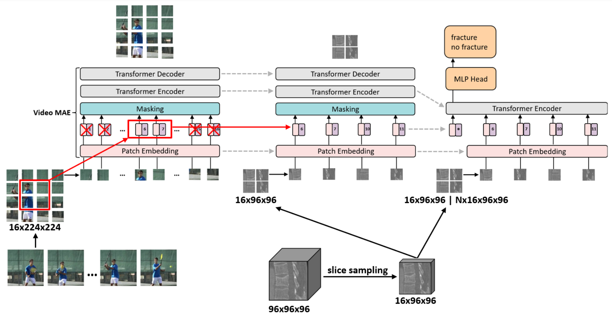

# Video-CT MAE: Self-supervised Video-CT Domain Adaptation for Vertebral Fracture Diagnosis
[](https://www.cs.cit.tum.de/en/camp/projects/diva/)
[](https://openreview.net/forum?id=shuwpLaOJP&referrer=%5BAuthor%20Console%5D(%2Fgroup%3Fid%3DMIDL.io%2F2024%2FConference%2FAuthors%23your-submissions))
[](https://2024.midl.io/)


This is the official repository for the paper [Video-CT MAE: Self-supervised Video-CT Domain Adaptation for Vertebral Fracture Diagnosis](https://openreview.net/pdf?id=shuwpLaOJP), which is presented at [MIDL 2024](https://2024.midl.io/).

**Authors**: [Lukas Buess][lb], [Marijn F. Stollenga][ms], [David Schinz][ds], [Benedikt Wiestler][bw], [Jan S. Kirschke][jsk], [Andreas Maier][am], [Nassir Navab][nn], [Matthias Keicher][mk]

[lb]:https://scholar.google.com/citations?user=kSTPIqMAAAAJ&hl=de
[ms]:https://scholar.google.de/citations?user=52L53fEAAAAJ&hl=en&oi=ao
[ds]:https://scholar.google.com/citations?user=rvCLes0AAAAJ&hl=de
[bw]:https://www.neurokopfzentrum.med.tum.de/neuroradiologie/mitarbeiter-profil-wiestler.html
[jsk]:https://www.neurokopfzentrum.med.tum.de/neuroradiologie/347.html
[am]:https://lme.tf.fau.de/person/maier/
[mk]:https://www.cs.cit.tum.de/camp/members/matthias-keicher/
[nn]:https://www.cs.cit.tum.de/camp/members/cv-nassir-navab/nassir-navab/

## Abstract
Vertebral body diagnosis is a critical task in medical image analysis that can greatly benefit from the utilization of deep learning techniques. However diagnosing vertebral fractures poses significant challenges in medical image analysis, especially due to the scarcity of labeled data and the inherent domain gap between 2D natural and 3D medical images. Addressing this problem, this paper introduces a novel approach to improve vertebral fracture diagnosis through self-supervised learning, utilizing a unique video-CT domain adaptation technique. Our method leverages transformer-based video pretraining and weights, adapted for CT image analysis, bridging the gap between video and medical image domains. We conduct self-supervised video-CT domain adaptation on a big unlabeled vertebra dataset, consisting of 27,776 vertebra crops, derived from seven publicly available CT datasets. Our comparative analysis reveals that our approach significantly outperforms existing selfsupervised learning methods in our vertebra classification downstream task. The paper not only presents a novel pretraining method but also provides insights into integrating video pretraining in medical image analysis, showcasing its potential in improving diagnostic accuracy for vertebral fractures.

## Method

<div align="center">
  
</div>


## Citation
```BibTeX
@inproceedings{buess2024videoct,
  title={Video-{CT} {MAE}: Self-supervised Video-{CT} Domain Adaptation for Vertebral Fracture Diagnosis},
  author={Lukas Buess and Marijn F. Stollenga and David Schinz and Benedikt Wiestler and Jan Kirschke and Andreas Maier and Nassir Navab and Matthias Keicher},
  booktitle={Submitted to Medical Imaging with Deep Learning},
  year={2024},
  url={https://openreview.net/forum?id=shuwpLaOJP},
  note={under review}
}
```

# Setup
1. Clone repository
    ```
    git clone https://github.com/lbuess/Video-CT_MAE.git
    ```

2. Set up the environment using the Makefile
    ```
    make env
    ```

# Code

## Pretraining
This pretraining code builds upon the work done in [Masked Autoencoders As Spatiotemporal Learners](https://github.com/facebookresearch/mae_st).
```BibTeX
@article{feichtenhofer2022masked,
  title={Masked autoencoders as spatiotemporal learners},
  author={Feichtenhofer, Christoph and Li, Yanghao and He, Kaiming and others},
  journal={Advances in neural information processing systems},
  volume={35},
  pages={35946--35958},
  year={2022}
}
```

### Dataset
To load the pretraining dataset create a .csv file that contains the following information of each vertebra:
- image: path to vertebra volume after base dataset path
- level_idx: vertebra level index

  | image                | level_idx       |
  | -------------------- | --------------- |
  | /path_to_file.nii    | 1               |
  | /path_to_file.nii    | 2               |
  | ...                  | ...             |


### Training
1. download pretrained ViT-Large Kinetics-700 checkpoint from [mae_st](https://github.com/facebookresearch/mae_st) repository
2. configure settings in `config.yaml` (see [/config/pretraining](/config/pretraining/))
3. run `python main.py`


## Finetuning

### Dataset
To load the dataset create a .csv file that contains the following information for each vertebra:
- image: path to vertebra volume after base dataset path
- class: no fracture (0), fracture (1)
- split: training / validation / test
- level_idx: vertebra level index

  | image               | class           | split           | level_idx          |
  | ------------------- | --------------- | --------------- | ------------------ |
  | /path_to_file.nii   | 0               | training        | 1                  |
  | /path_to_file.nii   | 1               | validation      | 2                  |
  | ...                 | ...             | ...             | ...                |

### Training
1. configure settings in `config.yaml` (see [/config/finetuning](/config/finetuning/))
2. run `python main.py task=finetuning`


# License
This project includes material that is licensed under the [Creative Commons Attribution-NonCommercial 4.0 International License](https://creativecommons.org/licenses/by-nc/4.0/deed.en).